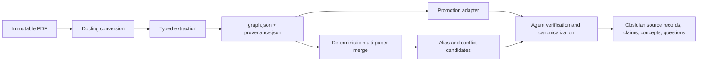

# Docling Graph and External Brain

## Bottom line

Docling Graph should be treated as an **optional PDF-to-candidate-graph engine in front of the vault**, not as a replacement for Obsidian or the Markdown knowledge model. It can add layout-aware conversion, typed extraction, deterministic node identities, page/chunk grounding, and cross-document graph fusion. The External Brain should remain the authoritative, human-readable layer that decides which extracted candidates become source records, atomic claims, concepts, questions, and contextual `[[wikilinks]]` under the [[system/protocol|Vault protocol]].

This division matters because Docling Graph validates extracted data against a Pydantic shape and grounds **entity nodes** to source regions, while this vault requires evidence-aware knowledge claims, semantic prose, explicit inference labels, and review of possible conflicts. Docling Graph can substantially improve candidate discovery; it cannot by itself establish that every extracted field or relationship is true.

## Areas of agreement

### Both systems favor structured, traceable knowledge

Docling Graph uses a staged pipeline: it converts a document with Docling, extracts validated Pydantic models using an LLM or VLM, converts them into a directed NetworkX graph, then optionally exports the result. Its graph schema is defined by the Pydantic template: identity fields determine stable nodes and `edge()` metadata determines directed relationship labels. [Official architecture](https://github.com/docling-project/docling-graph/blob/a9fa5450703b3304205c8da6baf9f72f2295b722/docs/introduction/architecture.md#L10-L54) [Official graph-conversion guide](https://github.com/docling-project/docling-graph/blob/a9fa5450703b3304205c8da6baf9f72f2295b722/docs/fundamentals/graph-management/graph-conversion.md#L58-L165)

That approach supports the vault's existing preference for explicit relationships over vague proximity. Docling Graph's templates distinguish identity-bearing entities from content-deduplicated components, while this vault distinguishes durable claims, concepts, questions, maps, and syntheses. The two schemas are not identical, but both make node identity and relationship meaning deliberate rather than incidental. [Official entity/component guide](https://github.com/docling-project/docling-graph/blob/a9fa5450703b3304205c8da6baf9f72f2295b722/docs/fundamentals/schema-definition/entities-vs-components.md#L17-L27) [Official relationship guide](https://github.com/docling-project/docling-graph/blob/a9fa5450703b3304205c8da6baf9f72f2295b722/docs/fundamentals/schema-definition/relationships.md#L9-L19)

### Docling Graph can strengthen paper ingestion

Docling Graph sends PDFs and other supported files through Docling, producing a structured `DoclingDocument`; the conversion layer retains document structure including pages, text, tables, images, and metadata. It can then serialize the document as Markdown or DocLang and use structure-aware chunking for long papers. [Official input-format guide](https://github.com/docling-project/docling-graph/blob/a9fa5450703b3304205c8da6baf9f72f2295b722/docs/fundamentals/pipeline-configuration/input-formats.md#L1-L28) [Official document-conversion guide](https://github.com/docling-project/docling-graph/blob/a9fa5450703b3304205c8da6baf9f72f2295b722/docs/fundamentals/extraction-process/document-conversion.md#L148-L220) [Official chunking guide](https://github.com/docling-project/docling-graph/blob/a9fa5450703b3304205c8da6baf9f72f2295b722/docs/fundamentals/extraction-process/chunking-strategies.md#L61-L80)

For complex or long papers, its dense extraction contract uses a two-phase skeleton-then-flesh process to discover entity instances before filling their attributes. The official project includes a detailed rheology-paper template, demonstrating that scientific papers can be modeled as papers, studies, experiments, batches, methods, instruments, datasets, and measurements rather than only as flat summaries. [Official dense-extraction guide](https://github.com/docling-project/docling-graph/blob/a9fa5450703b3304205c8da6baf9f72f2295b722/docs/fundamentals/extraction-process/dense-extraction.md#L1-L20) [Official rheology template](https://github.com/docling-project/docling-graph/blob/a9fa5450703b3304205c8da6baf9f72f2295b722/docs/examples/templates/rheology_research.py#L1-L42)

### Provenance is the strongest integration point

With provenance enabled, Docling Graph adds a `__provenance__` view to every entity node and writes a self-contained `provenance.json` ledger containing chunk text, page numbers, structural references, geometry, content hashes, and per-node lineage. Its resolution ladder explicitly distinguishes verbatim matches, approximate observations, document-level fallbacks, and unresolved nodes. Grounding is deterministic post-processing and does not require another LLM call. [Official provenance guide](https://github.com/docling-project/docling-graph/blob/a9fa5450703b3304205c8da6baf9f72f2295b722/docs/fundamentals/graph-management/provenance.md#L1-L13) [Provenance resolution levels](https://github.com/docling-project/docling-graph/blob/a9fa5450703b3304205c8da6baf9f72f2295b722/docs/fundamentals/graph-management/provenance.md#L43-L106) [Ledger schema](https://github.com/docling-project/docling-graph/blob/a9fa5450703b3304205c8da6baf9f72f2295b722/docs/fundamentals/graph-management/provenance.md#L122-L195)

This `supports` the vault's page-citation and source-audit requirements. It could give the ingestion agent a much better candidate page and source region than plain extracted text alone.

### Cross-document merge aligns with human review

Docling Graph can merge multiple exported graphs deterministically. Exact same-ID nodes fold, edges union, provenance is preserved per source, conflicting values are audited, and merely similar aliases are proposed rather than automatically fused. Its optional conflict-variant nodes retain which document supplied a losing value. [Official merge guide](https://github.com/docling-project/docling-graph/blob/a9fa5450703b3304205c8da6baf9f72f2295b722/docs/usage/cli/merge-command.md#L4-L16) [Merge behavior and conflict variants](https://github.com/docling-project/docling-graph/blob/a9fa5450703b3304205c8da6baf9f72f2295b722/docs/usage/cli/merge-command.md#L65-L96)

This closely matches the vault rule that potential conflicts and uncertain equivalences must be reviewed instead of silently resolved. Alias candidates and conflicting values could feed [[system/review-queue|Review queue]] entries, while the agent explains any accepted `supports`, `challenges`, `extends`, or `potential-conflict` relationship using [[system/relationships|Relationship vocabulary]].

## Meaningful differences

| Concern | Docling Graph | External Brain | Consequence |
| --- | --- | --- | --- |
| Primary unit | Domain entity defined by a Pydantic template | Claim, concept, question, source, map, or synthesis note | A Docling node must not automatically become an Obsidian note. |
| Schema | Closed, extraction-oriented schema selected before processing | Open-ended wiki that evolves through canonical Markdown pages | We need a promotion adapter and review policy, not a direct export. |
| Provenance | Primarily node-to-chunk/page grounding | Claim-to-evidence citation, plus explicit inference status | A grounded entity does not prove every field or edge attached to it. |
| Relationship semantics | Edge types declared in the extraction template | Relationships asserted in prose with evidence and review state | Extracted `SUPPORTS` or `CHALLENGES` edges should initially be candidates. |
| Durable storage | NetworkX in memory; `graph.json`, CSV, or Cypher on disk | Markdown files and Obsidian wikilinks | `graph.json` is a derived artifact; Markdown remains authoritative. |
| Cross-paper reconciliation | Exact stable IDs, audited conflicts, proposed aliases | Canonical filenames, contextual links, and human-reviewed synthesis | Merge output can suggest connections but does not replace cross-paper reasoning. |

The most important limitation is granularity of evidence. The official provenance contract attaches a compact view to **nodes**, and the binder locates identity values or other short distinctive strings in chunk text. The official documentation does not claim per-field or per-edge evidentiary grounding. Therefore, a page emitted for a node is a lead for verification, not automatic proof of every extracted claim or relationship. [Official provenance binder](https://github.com/docling-project/docling-graph/blob/a9fa5450703b3304205c8da6baf9f72f2295b722/docling_graph/core/provenance/binder.py#L172-L223) [Binder location logic](https://github.com/docling-project/docling-graph/blob/a9fa5450703b3304205c8da6baf9f72f2295b722/docling_graph/core/provenance/binder.py#L274-L320)

Docling Graph also does not independently discover every useful cross-paper relationship. Its merge is strongest when two documents yield the same identity under the same compatible template. A relationship omitted from the template cannot become an edge, and conceptual relations such as “Paper B challenges Paper A under a different population” still require agent synthesis and source verification.

## Proposed relationships

> [!important] Agent proposal
> The following architecture and mappings are design proposals, not claims made by the Docling Graph project.

### Proposed architecture

Docling Graph would `extend` the existing `scripts/extract_pdf.py` workflow by adding structured layout conversion and typed candidate extraction. It would not replace the current extractor, which remains a simple, deterministic fallback and supports direct visual checking of PDF pages.

The Docling output would `support` the vault's provenance protocol by supplying candidate page locations and source spans. Promotion into Markdown would `depend-on` a vault-specific adapter and review gate that enforce the existing evidence categories and citation syntax.

### Concrete integration seams

1. **Keep immutable originals unchanged.** Continue storing the PDF in `sources/papers/` and recording its SHA-256 in the source record. Treat Docling's own content-derived document ID and template-schema hash as additional derived metadata, not replacements for the vault SHA-256.
2. **Cache derived artifacts by source hash.** Proposed location: `tmp/docling-graph/<sha256>/`. Retain `document.json`, `graph.json`, `provenance.json`, `metadata.json`, and useful debug reports; exclude the directory from Git because the provenance ledger contains source chunk text.
3. **Create a vault-specific scholarly template.** A first template should extract bibliographic identity, research question, method, population/sample, dataset, experiment, reported result, limitation, and explicit author-stated relationships. Docling Graph supports hand-written templates, LLM-induced templates from example documents, and deterministic compilation from OWL/RDFS/SKOS, LinkML, or JSON Schema. [Official template-generation guide](https://github.com/docling-project/docling-graph/blob/a9fa5450703b3304205c8da6baf9f72f2295b722/docs/usage/cli/template-command.md#L4-L16) [Document and ontology generation](https://github.com/docling-project/docling-graph/blob/a9fa5450703b3304205c8da6baf9f72f2295b722/docs/usage/cli/template-command.md#L20-L88)
4. **Read the canonical JSON seam.** The adapter should consume `graph.json` and its sibling `provenance.json`, or use the in-memory `PipelineContext`. Docling Graph exposes a file-free JSON dictionary representation and rejects CSV/Cypher as merge inputs because those formats lose nested value types. [Official JSON exporter](https://github.com/docling-project/docling-graph/blob/a9fa5450703b3304205c8da6baf9f72f2295b722/docling_graph/core/exporters/json_exporter.py#L14-L26) [Official JSON importer](https://github.com/docling-project/docling-graph/blob/a9fa5450703b3304205c8da6baf9f72f2295b722/docling_graph/core/importers/graph_json.py#L25-L59)
5. **Map candidates rather than files one-to-one.** A paper/root node maps to a source record; a durable reported result may map to a claim; methods and recurring constructs may update canonical concepts; unresolved limitations may become questions. Experimental subnodes can remain only in derived JSON unless they add durable navigational value.
6. **Gate citations by provenance quality.** `verbatim` should provide a candidate PDF page for inspection. `observed`, document-scoped, or `unresolved` candidates should require manual or agent page inspection before becoming a source claim. Even a verbatim node anchor should not promote an attached field or edge without checking that the cited page supports it.
7. **Use merge output as a review generator.** Exact shared entities can suggest cross-paper connections. Alias candidates, scalar conflicts, cross-document splits, and conflict variants should become review items or agent-proposed synthesis material, never silent edits to canonical notes.

### Model and privacy boundary

The LLM extraction backend is routed through LiteLLM and can use remote providers or local Ollama/vLLM; the VLM extraction backend is local-only and expects GPU resources. Remote providers require credentials, while local runtimes do not require API keys. [Official backend guide](https://github.com/docling-project/docling-graph/blob/a9fa5450703b3304205c8da6baf9f72f2295b722/docs/fundamentals/pipeline-configuration/backend-selection.md#L18-L31) [Official API-key guide](https://github.com/docling-project/docling-graph/blob/a9fa5450703b3304205c8da6baf9f72f2295b722/docs/fundamentals/installation/api-keys.md#L3-L18)

**Proposal:** default to local document conversion and make the extraction backend an explicit user choice. Remote extraction transmits paper-derived content to the configured provider. Local inference improves privacy but introduces model, memory, speed, and hardware constraints. Because this repository is public, neither PDFs nor provenance ledgers containing their text should be committed.

## Maturity and phased recommendation

The inspected official revision declares Docling Graph version `1.9.1`, supports Python 3.10–3.13, and depends on Docling, Pydantic, NetworkX, and LiteLLM. Its changelog shows that graph fusion, self-describing exports, and template generation arrived in the 1.8 series, followed by Cypher and security fixes in 1.9.x. This is sufficient evidence for a controlled pilot, but not evidence that extraction quality is adequate for this user's academic corpus. [Official package metadata](https://github.com/docling-project/docling-graph/blob/a9fa5450703b3304205c8da6baf9f72f2295b722/pyproject.toml#L5-L52) [Official changelog](https://github.com/docling-project/docling-graph/blob/a9fa5450703b3304205c8da6baf9f72f2295b722/CHANGELOG.md#L5-L40) [Graph-fusion and template-generation changes](https://github.com/docling-project/docling-graph/blob/a9fa5450703b3304205c8da6baf9f72f2295b722/CHANGELOG.md#L171-L210)

Recommended sequence:

1. **Phase 0 — isolated evaluation:** run three representative papers without writing to the vault. Compare bibliographic accuracy, method/result recall, provenance resolution, false relationships, duplicate entities, runtime, and cost against the existing ingestion process.
2. **Phase 1 — assisted single-paper ingestion:** add Docling Graph as an optional preprocessor. The adapter produces a candidate manifest; the existing agent workflow verifies pages and writes Markdown.
3. **Phase 2 — reviewed cross-paper fusion:** merge only graphs produced by a compatible, versioned scholarly template. Route aliases and conflicts to review and create syntheses only after source checking.
4. **Phase 3 — scale only if needed:** consider Cypher/Neo4j for large graph queries after the Markdown workflow proves useful. Obsidian does not require a graph database, so this is optional.

The go/no-go criterion should be practical: Docling Graph should reduce paper-ingestion effort and surface useful relationships without increasing unsupported claims or citation errors. If it does not, retain it only for Docling conversion and layout/provenance artifacts.

## Uncertainty and missing evidence

- No Docling Graph run has yet been performed on this user's papers, so corpus-specific extraction accuracy and relationship quality are unknown.
- Local VLM and local LLM feasibility on this Ubuntu ARM64 machine has not been tested; remote LLM extraction is likely simpler operationally but has privacy and cost consequences.
- The page numbers produced by Docling Graph appear designed as document page numbers, but their exact agreement with Obsidian's rendered `#page=N` links must be verified on a sample PDF before automated citation generation.
- A generic scholarly template may be too shallow for specialized domains, while one template per domain may fragment identity and inhibit cross-paper merge. The right template boundary requires empirical testing.
- The official provenance model is node-centric. Field-level and edge-level verification remains an External Brain responsibility.
- `provenance.json` stores chunk text and can therefore reproduce substantial source content; retention and Git-ignore policy must be explicit before using it with copyrighted or sensitive papers.

## Sources

- [Docling Graph README](https://github.com/docling-project/docling-graph/blob/a9fa5450703b3304205c8da6baf9f72f2295b722/README.md)
- [Official architecture](https://github.com/docling-project/docling-graph/blob/a9fa5450703b3304205c8da6baf9f72f2295b722/docs/introduction/architecture.md)
- [Official schema-definition documentation](https://github.com/docling-project/docling-graph/tree/a9fa5450703b3304205c8da6baf9f72f2295b722/docs/fundamentals/schema-definition)
- [Official extraction-process documentation](https://github.com/docling-project/docling-graph/tree/a9fa5450703b3304205c8da6baf9f72f2295b722/docs/fundamentals/extraction-process)
- [Official provenance documentation](https://github.com/docling-project/docling-graph/blob/a9fa5450703b3304205c8da6baf9f72f2295b722/docs/fundamentals/graph-management/provenance.md)
- [Official merge documentation](https://github.com/docling-project/docling-graph/blob/a9fa5450703b3304205c8da6baf9f72f2295b722/docs/usage/cli/merge-command.md)
- [Official template-generation documentation](https://github.com/docling-project/docling-graph/blob/a9fa5450703b3304205c8da6baf9f72f2295b722/docs/usage/cli/template-command.md)
- [Official release history](https://github.com/docling-project/docling-graph/blob/a9fa5450703b3304205c8da6baf9f72f2295b722/CHANGELOG.md)
